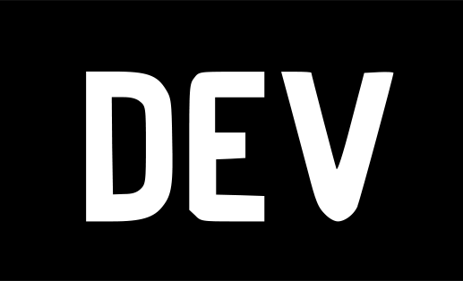

# Hi My name is Ryan Loughner

## Developer. Architect. Technical Writer. Tech Advocate.

Ryan writes code and make videos focusing on JavaScript development stacks for mobile and web applications, Flutter, React Native, tailwind, Firebase, Linode, and MongoDB. With close to 15 years of experience, Ryan is passionate about solving problems with technology, creating modern end-to-end custom software solutions that scale, and sharing his knowledge with others. He's proud to be a patent holder, and is a modern technology advocate. In his spare time, Ryan enjoys woodworking, smoking and grilling food, and fishing.

- 🚀  Currently working on a SaaS application using Remix.
- 🧠  Learning Astro
- ⚡  What did the amazed React component say to its child? I've got to give you props.
<!-- - 🖥️  See my portfolio at [My Portfolio](https://ryan-loughner.me) -->
<!-- - 🚀  I'm currently working on [an e-commerce starter app based on React, Tailwind, and Firebase.](https://react-store-starter.netlify.app/) -->
<!-- - 🤝  Open to collaborating on React and Firebase apps, MVP ideas, web and mobile apps -->

### Skills

<!--  -->
<!--  -->

<!---->

 

### Socials

 
 
<!--  
 
 
 -->
 
 
<!--
 
 
 
 -->

### Support Me

